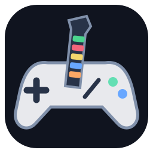
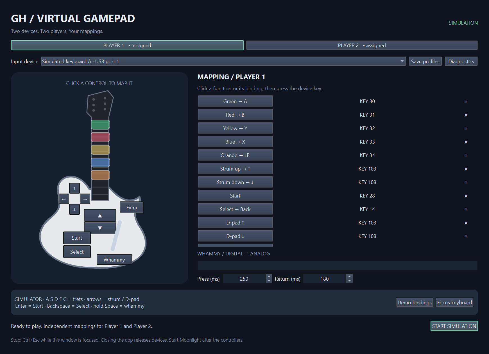

<p align="center"></p>

# GHVirtualGamePad

### Two guitars. Two players. No shared keyboard input.

[](https://github.com/BrainAlaw/GHVirtualGamePad/actions/workflows/check.yml)
[](LICENSE)

Turn two USB keyboard-mode guitars into **two independent virtual gamepads**, on Linux or Windows. Pick each receiver, click a control, press its physical button, and play.

Built for DOYO guitars and games such as **Guitar Hero World Tour: Definitive Edition**. Use the virtual controllers locally or pass them through streaming software such as Moonlight. This is a per-device keyboard-to-controller mapper: no hardcoded guitar layout, account, subscription or network service.

**[Download installers](https://github.com/BrainAlaw/GHVirtualGamePad/releases) · [Polski](docs/README.pl.md) · [Report a problem](https://github.com/BrainAlaw/GHVirtualGamePad/issues)**



## What you get

- Independent devices, bindings and live input feedback for Player 1 and Player 2.
- Click-to-bind guitar diagram **and a complete clickable mapping list**.
- Five frets, strum, D-pad, Start, Select, Extra and whammy.
- **Digital whammy → smooth virtual axis**, with adjustable press and return times.
- Exclusive capture of selected keyboards while playing; unrelated keyboards stay usable.
- Saved profiles, desktop/menu icon, installers and offline application runtimes.
- A hardware-free demo for exploring the interface.

You need distinguishable input devices. If one receiver merges both guitars into identical keyboard events, software cannot recover which guitar sent them.

## Platform status — 0.2.0

Version 0.2.0 is the first stable release. Compatibility still depends on the receiver, distribution and Windows driver policy; the table records what has actually been tested.

| Platform | Native implementation | Verification |
| --- | --- | --- |
| Linux x86_64 / CachyOS | evdev capture + uinput controllers | Owner reports successful physical guitar use. Automated mapping, GUI and installer tests. |
| Windows x64 | Interception capture + ViGEmBus Xbox 360 controllers | Owner-confirmed two-guitar gameplay, separate inputs and GHWT:DE compatibility fix on Windows. Native two-pad XInput diagnostics and automated installer tests pass. A clean driver installation has not been tested on every Windows security configuration. |

Linux exposes an Xbox-layout uinput gamepad, not the Xbox USB protocol. Windows creates XInput-compatible Xbox 360 controllers. When streaming, the host's streaming software decides how to expose them to the game.

## Install

### Linux / CachyOS

Download `ghvirtualgamepad-0.2.0-linux-x86_64.tar.gz`, extract it, then run **without sudo**:

```bash
cd ghvirtualgamepad
bash install.sh
```

Launch **GHVirtualGamePad** from your application menu. The bundle includes Python, Qt and the backend: no Rust compiler, pip downloads or virtual environment setup. The installer itself needs system Python 3.10+. Desktop OpenGL/EGL and X11/Wayland runtime libraries must be available. Built on Ubuntu 24.04; requires glibc 2.39 or newer, including current CachyOS. Not an Alpine/musl package.

- `bash install.sh --dry-run` previews installation.
- Run `app/GHVirtualGamePad` directly for portable use.
- If device access is denied, select the receiver and click **Enable device access**. Polkit authorization installs narrow udev access rules and enables uinput. The GUI never runs as root.
- Replug the receiver after access setup if your desktop session has not applied the new ACL yet.

### Windows

Run `GHVirtualGamePad-0.2.0-windows-x64-setup.exe`. It installs the application, icon, Start-menu shortcut and optional desktop shortcut. Python and Rust are **not required**.

The installer offers missing dependencies using bundled, SHA-256-pinned upstream payloads:

| Dependency | Purpose | Important limitation |
| --- | --- | --- |
| ViGEmBus 1.22.0 | Virtual Xbox 360 gamepads | [Retired upstream](https://docs.nefarius.at/projects/ViGEm/End-of-Life/); no ongoing driver updates. |
| Interception 1.0.1 | Per-keyboard capture and suppression | System-wide keyboard/mouse filter driver; restart required. Upstream binary terms are for [non-commercial use](https://github.com/oblitum/Interception#license). |

Save your work, approve UAC, and restart Windows if drivers were installed. Existing driver services are not reinstalled. To retry dependency setup, rerun the installer. The application runs without elevation.

**Do not disable Secure Boot, Memory Integrity or signature enforcement.** If policy blocks a driver, this backend is not compatible with that configuration. Interception upstream lists testing through Windows 10; Windows 11 compatibility depends on the machine. Anti-cheat software may reject input filter drivers. The application installer is not Authenticode-signed; verify its checksum and provenance rather than disabling protections.

Windows mappings are saved, but **receivers must be selected each session**: Interception slot numbers are not persistent USB identities. After unplugging/replugging, stop and reselect the receiver. All guitar buttons must appear on the selected keyboard slot; Windows multi-slot aggregation is not implemented.

## First song in six steps

1. Put both guitars into **keyboard mode**. Both using hardware “Player 1” mode is fine if the OS sees separate devices.
2. Select the first receiver for **Player 1**. Identify it by unplugging/replugging if necessary.
3. Click a fret, function name or binding value. Press and release its physical control. Unused functions can remain blank.
4. Map whammy as a button. **Press (ms)** controls travel to full deflection; **Return (ms)** controls spring-back.
   For GHWT:DE, enable **GHWT:DE fix** beside Extra if the game only accepts that action from a D-pad direction. Extra will output D-pad Left instead of RB for that player.
5. Switch to **Player 2**, choose the other receiver, and repeat. One guitar also works alone.
6. Click **Save profiles**, release every physical control, then **Start controllers**. Launch the local game and bind both controllers. If you use Moonlight or another streaming solution, connect it after starting the controllers.

Stop before editing. Close the app normally to release capture and virtual controllers. Ctrl+Esc stops them **while this window has focus**; it is not a global emergency shortcut. Never select your everyday keyboard or a receiver shared with a mouse. In preview mode, selected keyboard events still reach other apps: close chat/password fields while teaching bindings.

## Virtual layout

| Guitar function | Gamepad output |
| --- | --- |
| Green / Red / Yellow / Blue / Orange | A / B / Y / X / LB |
| Strum up / down | D-pad up / down |
| D-pad | D-pad |
| Start / Select | Start / Back |
| Extra | RB, or D-pad Left with the optional GHWT:DE fix |
| Digital whammy | Right stick Y: neutral → positive full scale → neutral |

These are output defaults, not assumed physical key codes. Teach your receiver once, then map the resulting controller in the game. Whammy is a synthetic axis, not a measurement of physical lever position.

## Profiles, updates and removal

Your test build does not expire and already supports saving profiles. Installation adds a convenient launcher and managed location; it is not required to keep mappings.

**Save profiles** shows the exact config path. Normally:

- Linux: `~/.config/GHVirtualGamePad/GHVirtualGamePad/profiles.json` (respects `XDG_CONFIG_HOME`).
- Windows: Qt's user-local config folder, normally `%LOCALAPPDATA%/GHVirtualGamePad/GHVirtualGamePad/windows-profiles.json`.
- Demo: `demo-profiles.json`, separate from real input profiles.

Back up this folder before upgrading. Linux and Windows physical key codes differ, so teach Windows bindings separately. Linux installation keeps previous versions; launch a retained version directly to roll back. Windows upgrades use the same application directory. Neither installer intentionally removes profiles.

Windows uninstall leaves shared drivers because other applications may need them. Linux has no automatic uninstaller yet: application files, desktop entry, profiles and privileged access rules are separate. Do not remove rules needed by another installation.

## Troubleshooting

| Symptom | Check |
| --- | --- |
| Both guitars control Player 1 | Select two different receivers/slots, not the same device twice. |
| No Linux inputs / cannot create pad | Use **Enable device access**, check polkit, replug the receiver. |
| No Windows keyboards | Install Interception, reboot; confirm Windows did not block its driver. |
| Windows cannot create controllers | Check ViGEmBus and free XInput slots; close other virtual-controller tools. XInput supports four slots. |
| Streaming software does not see pads | Start controllers first, then restart/reconnect the streaming session. Local play does not require streaming. |
| Keys still type in the game | Preview does not suppress input. Start controllers and verify device selection. |
| Whammy behaves backward | Invert/rebind Right Y in the game. |
| Pad remains after force-killing the app | Close normally whenever possible. If a Windows target remains, restart Windows. |

**Diagnostics** saves device IDs and profiles, not keystroke history. Review IDs/USB serials before posting publicly. Include OS/driver versions, one/two-player results and reproduction steps in reports.

## Development and verification

Rust handles device access, mapping and virtual gamepads. Qt Quick/QML supplies the UI through a thin PySide6 shell. Communication uses private stdin/stdout pipes. No persistent root daemon or network listener is installed.

- Linux: `bash run.sh`.
- Windows: `./run.ps1`; `./run.ps1 -Demo` needs no drivers. Native development needs `drivers/interception.dll` beside the backend; `tools/prepare_windows.py` downloads its payload.
- Native offline bundles: `tools/build_frozen.py` / `tools/build_windows.py`.
- Windows installer: Inno Setup 6, `packaging/windows.iss`.
- GitHub Actions builds installers on their native OS and checks install/upgrade. It does not install input-filter drivers on CI hosts.

```text
cargo fmt --check
cargo clippy --locked --all-targets -- -D warnings
cargo test --locked
cargo build --locked
python -m unittest discover -s tests -v
python gui/app.py --demo --smoke-test
```

Opt-in native Windows check: close games, then `python tools/check_windows.py target/debug/ghvirtualgamepad.exe`. It creates two temporary pads and reads distinct axis values through XInput, then enumerates keyboards **without capturing physical input**. This diagnostic complements the owner-confirmed two-guitar gameplay test.

See [release verification](docs/RELEASING.md), [changelog](CHANGELOG.md) and [dependency notices/source information](THIRD_PARTY.md).

## License

Original code and icon: **[MIT](LICENSE)**. Dependencies retain their terms. MIT does not grant commercial rights to Interception's driver assets. Qt is dynamically linked and replaceable; license texts are included in bundles.

Not affiliated with DOYO, Microsoft, Xbox, Guitar Hero, Activision or Moonlight.
